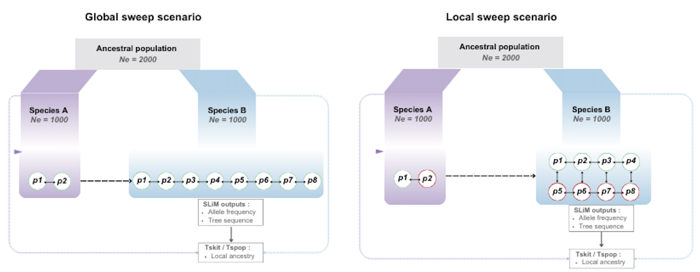

# Adaptive introgression in _Ciona intestinalis_

Simulation and analysis codes for studying the chromosomal footprint of adaptive introgression in subdivided populations.

---

## Simulations

- Simulation-based approach to model global vs. local adaptive introgression.  
- Examined how allele frequency and lenght of introgressed tracts vary across the two models.  

---

## Empirical Data

- Case study: _Ciona robusta_ → _Ciona intestinalis_ introgression.  
- Genotyped 96 individuals across 8 populations using phased data.  

---

## Requirements

- SLiM, Python 3, R
